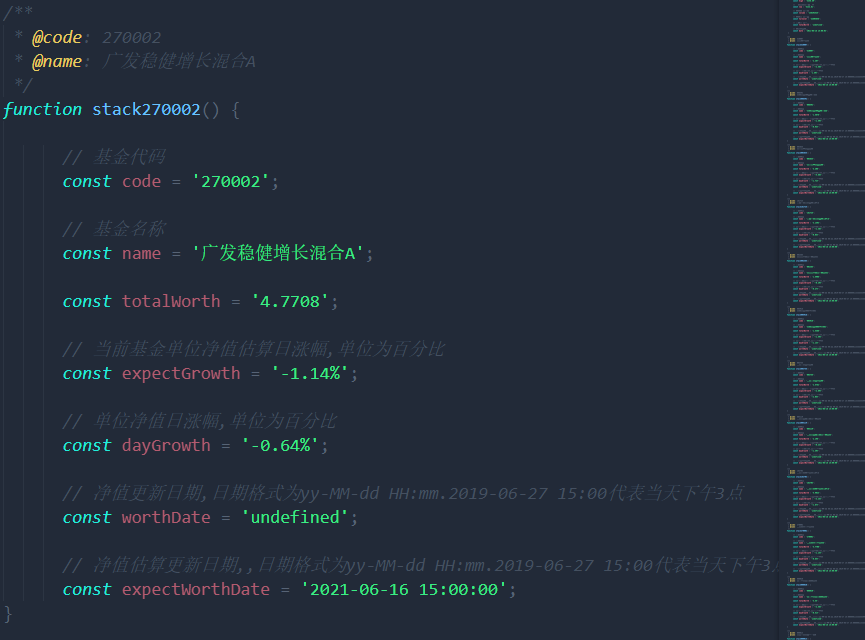
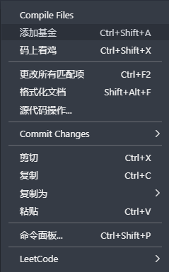
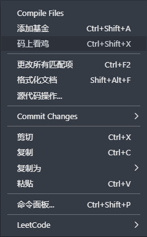

## 码上看🐓
插件会根据设置的基金代码获取当前基金涨跌情况数据,然后生成js代码,这样就可以在代码里查看基金情况😏

## 使用📈
1️⃣ 编辑模式下右击 `添加基金`或者使用快捷键Ctrl+Shift+A增加基金

2️⃣  打开一个js文件,然后右击 `码上看鸡`或者使用快捷键Ctrl+Shift+X

## 配置

### stack.chickenArray

 - 作用: 配置需要生成的基金代码

 - 类型: Array<string>

 - 默认值: [ "320007","008592","003834","161725","002364", "005918","003745","004119","162703","270002"]

### stack.chickenSimple

 - 作用: 配置生成简约关键信息还是显示完整信息,false则显示完整信息

 - 类型: boolean

 - 默认值: true

### stack.chickenBoard

 - 作用: 配置是否生成大盘指数数据情况,false则不显示

 - 类型: boolean

 - 默认值: true

## 关于本插件🍻 

 - 插件接口使用的是小熊同学开放的接口,感谢小熊同学. 接口地址`https://www.doctorxiong.club/api/`

 - 插件灵感来自另一款插件 `韭菜盒子`,插件功能丰富强大,但是对我而言不够隐蔽,而且一直想写一个自己的vs code插件,于是有了这个插件.如果你需要更强大的功能,推荐安装`韭菜盒子`这个插件😄
## github 🔗

https://github.com/stack-stark/observe-chicken-in-code

## 使用遇到了问题或者缺陷 ❓
https://github.com/stack-stark/observe-chicken-in-code/issues

## License 📖
MIT

